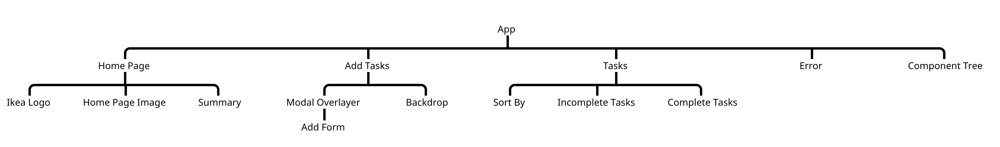

# IKEA Shopping List

IKEA Shopping List is a React application that targets the IKEA consumer. By using this application, the consumer can add his or her wish list on our plataform, storing it for future use.

## Installation

Use the package manager [React](https://create-react-app.dev/docs/getting-started/) to install the IKEA Shopping List.

Fork this directory and run in the terminal:

```bash
git pull
npm install
npm start
```

## Dependencies and Dev Dependencies:

"gh-pages": "^3.2.3",
"react": "^17.0.2",
"react-dom": "^17.0.2",
"react-router": "^6.0.0-beta.8",
"react-router-dom": "^6.0.0-beta.8",
"react-scripts": "4.0.3",
"uuid": "^8.3.2"

"@testing-library/react": "^11.2.7",
"@testing-library/jest-dom": "^5.16.1",
"@testing-library/user-event": "^12.8.3"

## Component Tree:


It can also be found at [https://limatfc.github.io/ikeaShoppingList/#/componenttree](https://limatfc.github.io/ikeaShoppingList/#/componenttree)
